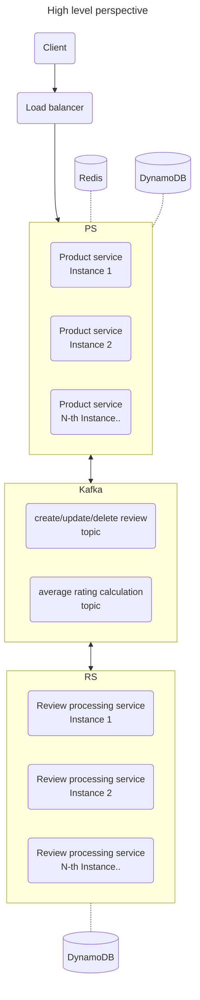

# CT

Hello visitor :wave: ! This repo was created as assignment homework for a engineering role I applied for and reflects my thoughts at that time on a given use-case.

<!-- @import "[TOC]" {cmd="toc" depthFrom=1 depthTo=6 orderedList=false} -->

<!-- code_chunk_output -->

- [CT](#ct)
  - [Overview](#overview)
  - [Assignment notes](#assignment-notes)
    - [Architecture](#architecture)
    - [Caching](#caching)
      - [Cache directly in service](#cache-directly-in-service)
      - [Side-car Redis](#side-car-redis)
      - [Redis](#redis)
      - [DAX in front of DynamoDB](#dax-in-front-of-dynamodb)
      - [API GW / CDN cache](#api-gw--cdn-cache)
    - [DB](#db)
    - [Messaging](#messaging)
    - [API](#api)
  - [How to](#how-to)
    - [Start whole project](#start-whole-project)
    - [Start just one of the services](#start-just-one-of-the-services)
    - [Build for production](#build-for-production)
    - [Run other tasks](#run-other-tasks)

<!-- /code_chunk_output -->

---

## Overview



TODO: add sequence diagrams

---

## Assignment notes

### Architecture

Alternative to writing to DB, cache and Kafka during product / review creation/modification/deletion would be to use outbox pattern with CDC (DynamoDB Streams + AWS Lambda):

- in product-service write only to DB
- DynamoDB will fire event
- AWS Lambda will trigger, process the event and write to Cache
- review-processing-service Lambda will trigger, process the event and write to its own DynamoDB
- DynamoDB will fire event
- product-service Lambda will trigger, process the event and update rating in DB

TODO: add sequence diagrams for different cases - adding/modifying a review, adding a new product

### Caching

#### Cache directly in service

Cache products and reviews in JS object or map, great for cases when the record is written once, never modified and read many times.

- on create / on update
  - write to DB
  - store to cache
- on delete
  - delete from cache
  - delete from DB
- on read
  - read from cache
  - if not found
    - read from DB
    - store to cache

note: order of cache / DB operation matters, e.g. if we would store in cache first and subsequent write to DB fails for any reason, we have a cache record, which we need to take care of

</br>

- pros
  - fast (compared to Redis - no extra network hop)
  - easy of use / implementation - packages exists - e.g. https://www.npmjs.com/package/cache-manager, or nest.js specific https://github.com/nestjs/cache-manager
  - can be combined with other caching solution
- cons
  - if caching mutable records (like in this case) set low cache record TTL and accept that some users may get stale records
    - can be partially mitigated by ensuring on load balancer side that request for same product will be routed to same instance
    - not an issue if there will be always just a single instance serving all requests, for cost optimization of read-heavy services not requiring HA
  - with a lot of products / reviews can lead to OOM (need to be mitigated by cache clearing - LRU / LFU strategy, or TTL, or some arbitrary cache record count)
  - service updates / cluster re-balancing / etc. will lead to more DB reads temporarily, as the cache will be empty on fresh instance startup

#### Side-car Redis

Run small Redis container as a side-car (container in same pod as node.js service), standalone memory-only without persistance layer

- on create
  - fire following requests concurrently
    - write to DB
    - store to cache
  - handle failed DB write - delete from cache as well
- on update
  - fire following requests concurrently
    - write to DB
    - store to cache
  - handle failed DB write - delete from cache
- on delete
  - fire following requests concurrently
    - delete from cache
    - delete from DB
- on read
  - read from cache
  - if not found (or cache unavailable)
    - read from DB
    - store to cache (with a possibility to do this without awaiting a response from cache via emitting an event and async handler)

note: Promise.allSettled should be used for concurrent request instead of Promise.all, e.g. during creation we don't want to fail the request if only writing to cache fails, or in other cases error from cache or DB situation need to be handled differently

open point for discussion: how to properly handle failed cache update / delete?

</br>

- pros
  - depending on k8s node topology and pod placement can be a bit faster compared to shared Redis (or cache hosted outside of k8s cluster)
- cons
  - if caching mutable records (like in this case) set low cache record TTL and accept that some users may get stale records
    - can be partially mitigated by ensuring on load balancer side that request for same product will be routed to same instance
    - not an issue if there will be always just a single instance serving all requests, for cost optimization of read-heavy services not requiring HA
  - cache is local to the service instance - in case of load balanced services request to read same product can be served by different instances, leading to more DB reads
  - service updates / cluster re-balancing / etc. will lead to more DB reads temporarily, as the cache will be empty on fresh instance startup
  - can not be done in Lambda

#### Redis

Run a Redis instance with or without persistance layer, as a service in k8s cluster or AWS hosted. Same CRUD procedure as with side-car Redis above.

Alternative to directly storing records in cache from the product-service is to emit create/update/delete product events (in addition to review events) and use a Kafka -> Redis sink (or another microservice).

- pros
  - still faster compared to going directly to DynamoDB
- cons
  - there is still a low risk that a data in cache and DB can be out of sync

#### DAX in front of DynamoDB

Use DAX (DynamoDB Accelerator) in front of DynamoDB. I can't judge pros & cons, haven't use the service nor read its limitations.

#### API GW / CDN cache

Implementing caching in front of a service on API GW or Cloudfront / CDN level is probably worthwhile only when we are OK with some stale records (depending on cache TTL setting).

### DB

DynamoDB provides following benefits for this use-case:

- average rating calculation can be done in just a single write (no previous read necessary)
- maintains high throughput for writing average rating calculation even in case of switching to non-FIFO messaging without record locking or transactions
- retrieving one product and its related reviews can be done with single query (with pagination), using single table design
- consistent latency independently of number of products
- in case of switching the service to serverless it does not need any special care

Limitations:

- combined size of review text + name is limited to 400 KB (max item size in DynamoDB), can be extended by using compression (store the review text compressed, un-compress on read in product-service)

### Messaging

Kafka provides following benefits for this use-case:

- FIFO ordering for calculating average rating (average rating in product DB is never overwritten by delayed older message), using product ID as Kafka message key

To keep correct FIFO order create, update and delete review events

### API

- REST vs RPC-like naming

---

## How to

### Prerequisites

In order to run this project you should have following installed on your computer:

- node.js 18 or higher
- docker

Run following commands:

- `npm i`
- `cp apps/product-service/.env.example apps/product-service/.env`
- `cp apps/review-processing-service/.env.example apps/review-processing-service/.env`
- `npx nx run-many -t build`
- `npx nx run-many -t container`

### Start whole project

Run `docker-compose up` to start and press ctrl+c to stop.
Or run `docker-compose up -d` (-d stands for 'detached') to start and be able to use same terminal window, `docker-compose down` to stop.

After project starts-up, there are following helper UIs available:

- for DynamoDB: http://localhost:8001
- for Kafka: http://localhost:8080

### Start just one of the services

Run one of

- `npx nx serve product-service`
- `npx nx serve review-processing-service`

to start the development server with `watch mode` enabled.

### Build for production

Run `npx nx build ct` to build the application. The build artifacts are stored in the output directory (e.g. `dist/` or `build/`), ready to be deployed.

### Run other tasks

Repo uses NX monorepo tool and to execute tasks with Nx use the following syntax:

```
npx nx <target> <project> <...options>
```

You can also run multiple targets:

```
npx nx run-many -t <target1> <target2>
```

..or add `-p` to filter specific projects

```
npx nx run-many -t <target1> <target2> -p <proj1> <proj2>
```

Targets can be defined in the `package.json` or `projects.json`. Learn more [in the docs](https://nx.dev/features/run-tasks).
