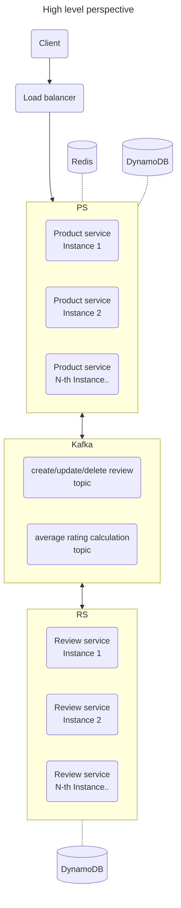

# CT

Hello visitor :wave: ! This repo was created as assignment homework for a engineering role I applied for and reflects my thoughts at that time on a given use-case. Repo was generated using NX monorepo tool

<!-- @import "[TOC]" {cmd="toc" depthFrom=1 depthTo=6 orderedList=false} -->

<!-- code_chunk_output -->

- [CT](#ct)
  - [Overview](#overview)
  - [Assignment notes](#assignment-notes)
    - [Caching](#caching)
      - [Cache directly in service](#cache-directly-in-service)
      - [Side-car Redis](#side-car-redis)
      - [Shared Redis](#shared-redis)
      - [DAX in front of DynamoDB](#dax-in-front-of-dynamodb)
      - [API GW / CDN cache](#api-gw--cdn-cache)
    - [DB](#db)
  - [How to](#how-to)
    - [Start whole project](#start-whole-project)
    - [Start just one of the services](#start-just-one-of-the-services)
    - [Build for production](#build-for-production)
    - [Run other tasks](#run-other-tasks)

<!-- /code_chunk_output -->

---

## Overview



---

## Assignment notes

### Caching

#### Cache directly in service

Cache products and reviews in JS object or map.

- on create / on update
  - write to DB
  - store to cache
- on delete
  - delete from cache
  - delete from DB
- on read
  - read from cache
  - if not found
    - read from DB
    - store to cache

note: order of cache / DB operation matters, e.g. if we would store in cache first and subsequent write to DB fails for any reason, we have a cache record, which we need to take care of

</br>

- pros
  - fast (compared to Redis - no extra network hop)
  - easy of use / implementation - packages exists - e.g. https://www.npmjs.com/package/cache-manager, or nest.js specific https://github.com/nestjs/cache-manager
  - can be combined with other caching solution
- cons
  - **limited to one service instance (no load balancing), or do partial shortlived caching and accept some stale records**
  - with a lot of products / reviews can lead to OOM (need to be mitigated by cache clearing - LRU / LFU strategy, or TTL, or some arbitrary cache record count)
  - service updates / cluster re-balancing / etc. will lead to more DB reads temporarily, as the cache will be empty on fresh instance startup
  - can not be done in Lambda (except for a single instance lambdalith - one lambda for all CRUD operations with reserved concurrency set to 1, which doesn't make any sense)

#### Side-car Redis

Run small Redis container as a side-car (container in same pod as node.js service), memory-only without persistance layer

- on create
  - fire following requests concurrently
    - write to DB
    - store to cache
  - handle failed DB write - delete from cache as well
- on update
  - fire following requests concurrently
    - write to DB
    - store to cache
  - handle failed DB write - delete from cache
- on delete
  - fire following requests concurrently
    - delete from cache
    - delete from DB
- on read
  - read from cache
  - if not found (or cache unavailable)
    - read from DB
    - store to cache (with a possibility to do this without awaiting a response from cache via emitting an event and async handler)

note: Promise.allSettled should be used for concurrent request instead of Promise.all, e.g. during creation we don't want to fail the request if only writing to cache fails, or in other cases error from cache or DB situation need to be handled differently

open point for discussion: how to properly handle cache update, or delete, if it fails? E.g. shutdown service (via emitting a custom event and calling app.close() - don't process.exit()), or temporarily (via global variable) skip cache until failed update / delete cache record request is successfully retried?

</br>

- pros
  - depending on k8s node topology and pod placement can be a bit faster compared to shared Redis (or cache hosted outside of k8s cluster)
- cons
  - cache is local to the service instance - in case of load balanced services request to read same product can be served by different instances, leading to more DB reads
  - service updates / cluster re-balancing / etc. will lead to more DB reads temporarily, as the cache will be empty on fresh instance startup
  - can not be done in Lambda

#### Shared Redis

Run a Redis instance with or without persistance layer, as a service in k8s cluster or AWS hosted. Same CRUD procedure as with side-car Redis above.

#### DAX in front of DynamoDB

Use DAX (DynamoDB Accelerator) in front of DynamoDB. I can't judge pros & cons, haven't use the service nor read its limitations.

#### API GW / CDN cache

Implementing caching in front of a service on API GW or Cloudfront / CDN level is probably worthwhile only when we are OK with some stale records (depending on cache TTL setting), but would be the fastest non client-side solution.

### DB

DynamoDB provides following benefits for this use-case:

- average rating calculation can be done in just a single write (no previous read necessary)
- retrieving one product and its related reviews can be done with one query (with pagination), using single table design
- consistent latency independently of number of products

## How to

### Start whole project

### Start just one of the services

Run one of

- `npx nx serve product-service`
- `npx nx serve review-service`

to start the development server with `watch mode` enabled.

### Build for production

Run `npx nx build ct` to build the application. The build artifacts are stored in the output directory (e.g. `dist/` or `build/`), ready to be deployed.

### Run other tasks

To execute tasks with Nx use the following syntax:

```
npx nx <target> <project> <...options>
```

You can also run multiple targets:

```
npx nx run-many -t <target1> <target2>
```

..or add `-p` to filter specific projects

```
npx nx run-many -t <target1> <target2> -p <proj1> <proj2>
```

Targets can be defined in the `package.json` or `projects.json`. Learn more [in the docs](https://nx.dev/features/run-tasks).
