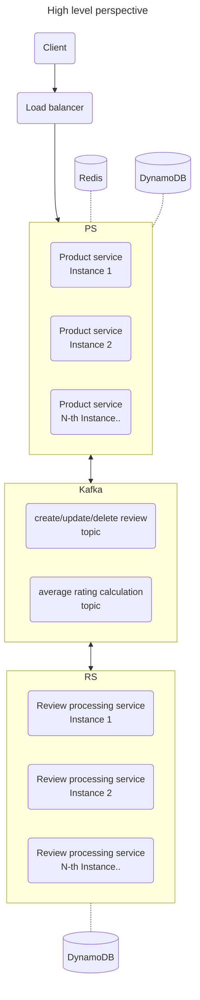
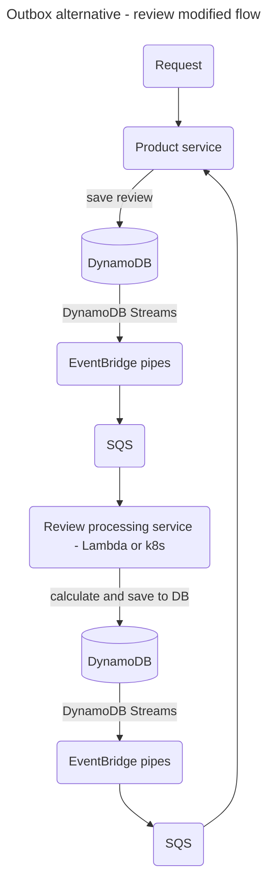

# CT

Hello visitor :wave: ! This repo was created as assignment homework for a engineering role I applied for and reflects my thoughts at that time on a given use-case.

<!-- @import "[TOC]" {cmd="toc" depthFrom=1 depthTo=6 orderedList=false} -->

<!-- code_chunk_output -->

- [CT](#ct)
  - [Overview](#overview)
  - [Assignment notes](#assignment-notes)
    - [What has been implemented](#what-has-been-implemented)
    - [Architecture](#architecture)
    - [Caching](#caching)
      - [Cache directly in service](#cache-directly-in-service)
      - [Side-car Redis](#side-car-redis)
      - [Redis](#redis)
      - [DAX in front of DynamoDB](#dax-in-front-of-dynamodb)
      - [API GW / CDN cache](#api-gw--cdn-cache)
    - [DB](#db)
    - [Messaging](#messaging)
    - [API](#api)
    - [IDs](#ids)
  - [How to](#how-to)
    - [Prerequisites](#prerequisites)
    - [Start project](#start-project)
    - [Start just one of the services for development purposes](#start-just-one-of-the-services-for-development-purposes)
    - [Test](#test)
    - [Build](#build)
    - [Run other tasks](#run-other-tasks)

<!-- /code_chunk_output -->

---

## Overview



---

## Assignment notes

### What has been implemented

- two Nest.js services with 2 instances each, exposed on different ports
- single node DynamoDB with two tables
- single node Kafka with two topics for messaging
- single node Redis for caching
- UIs for DynamoDB, Kafka, OpenApi, Redis (provided, not built as part of this project)
- all linked together via docker-compose, including tables and topics creation
- validation of incoming API requests
- shared API / events DTOs
- shared DynamoDB lib suitable for three shaking (for Lambda)
- open-api spec
- logging details of each API request
- linking related logs via correlationId (only in API part)
- linting
- building Docker images for both services
- some example e2e tests (I skipped unit tests, but I would not leave real world project without solid unit test coverage)

### Architecture

Limitation of above design (and as-is implementation) is risk of losing events when Kafka becomes unavailable during review modification. Alternative to writing to multiple places (DB, Kafka and potentially cache) and handling exceptions during review creation/modification/deletion request is to use outbox pattern with CDC (DynamoDB Streams with some combination of Lambda / Kinesis / EventBridge pipes + SQS):



### Caching

#### Cache directly in service

Cache products and reviews in JS object or map, great for cases when the record is written once, never modified and read many times.

- on create / on update
  - write to DB
  - store to cache
- on delete
  - delete from cache
  - delete from DB
- on read
  - read from cache
  - if not found
    - read from DB
    - store to cache

note: order of cache / DB operation matters, e.g. if we would store in cache first and subsequent write to DB fails for any reason, we have a cache record, which we need to take care of

</br>

- pros
  - fast (compared to Redis - no extra network hop)
  - easy of use / implementation - packages exists - e.g. https://www.npmjs.com/package/cache-manager, or nest.js specific https://github.com/nestjs/cache-manager
  - can be combined with other caching solution
- cons
  - if caching mutable records (like in this case) set low cache record TTL and accept that some users may get stale records
    - can be partially mitigated by ensuring on load balancer side that request for same product will be routed to same instance
    - not an issue if there will be always just a single instance serving all requests, for cost optimization of read-heavy services not requiring HA
  - with a lot of products / reviews can lead to OOM (need to be mitigated by cache clearing - LRU / LFU strategy, or TTL, or some arbitrary cache record count)
  - service updates / cluster re-balancing / etc. will lead to more DB reads temporarily, as the cache will be empty on fresh instance startup

#### Side-car Redis

Run small Redis container as a side-car (container in same pod as node.js service), standalone memory-only without persistance layer

- on create
  - fire following requests concurrently
    - write to DB
    - store to cache
  - handle failed DB write - delete from cache as well
- on update
  - fire following requests concurrently
    - write to DB
    - store to cache
  - handle failed DB write - delete from cache
- on delete
  - fire following requests concurrently
    - delete from cache
    - delete from DB
- on read
  - read from cache
  - if not found (or cache unavailable)
    - read from DB
    - store to cache (with a possibility to do this without awaiting a response from cache via emitting an event and async handler)

note: Promise.allSettled should be used for concurrent request instead of Promise.all, e.g. during creation we don't want to fail the request if only writing to cache fails, or in other cases error from cache or DB situation need to be handled differently

open point for discussion: how to properly handle failed cache update / delete?

</br>

- pros
  - depending on k8s node topology and pod placement can be a bit faster compared to shared Redis (or cache hosted outside of k8s cluster)
- cons
  - if caching mutable records (like in this case) set low cache record TTL and accept that some users may get stale records
    - can be partially mitigated by ensuring on load balancer side that request for same product will be routed to same instance
    - not an issue if there will be always just a single instance serving all requests, for cost optimization of read-heavy services not requiring HA
  - cache is local to the service instance - in case of load balanced services request to read same product can be served by different instances, leading to more DB reads
  - service updates / cluster re-balancing / etc. will lead to more DB reads temporarily, as the cache will be empty on fresh instance startup
  - can not be done in Lambda

#### Redis

Run a Redis instance with or without persistance layer, as a service in k8s cluster or AWS hosted. Same CRUD procedure as with side-car Redis above.

Alternative to directly storing records in cache from the product-service is to emit create/update/delete product events (in addition to review events) and use a Kafka -> Redis sink (or another microservice).

- pros
  - still faster compared to going directly to DynamoDB
- cons
  - there is still a low risk that a data in cache and DB can be out of sync

#### DAX in front of DynamoDB

Use DAX (DynamoDB Accelerator) in front of DynamoDB. I can't judge pros & cons, haven't use the service nor read its limitations, but could be worthwhile to do research / PoC.

#### API GW / CDN cache

Implementing caching in front of a service on API GW or Cloudfront / CDN level is probably worthwhile only when we are OK with some stale records (depending on cache TTL setting).

### DB

Notes related to picking DynamoDB for this use case:

- average rating calculation can be done in just a single write (no previous read necessary), with idempotence (using Kafka partition offset)
- maintains high throughput for writing average rating calculation even in case of switching to non-FIFO messaging without record locking or transactions (but will need to figure out different idempotence mechanism)
- retrieving one product and its related reviews can be done with single query (with pagination), using single table design, in case a new requirement of retrieving reviews (and not just average rating) together with product comes
- consistent latency independently of number of products
- in case of switching the service to serverless it does not need any special care
- combined size of review text + other review attributes is limited to 400 KB (max item size in DynamoDB), can be partially mitigated using compression (store the review text compressed, un-compress on read in product-service)
- deleting product does not delete its reviews, this needs a query + batchWrite

### Messaging

Notes related to picking Kafka for this use case:

- FIFO ordering for calculating average rating (average rating in product DB is never overwritten by delayed older message) using product ID as Kafka message key
- to keep correct FIFO order create, update and delete review events need to be in one topic and productId needs to be set as message key as well
- currently only per message processing is implemented, to increase throughput increase number of partitions + number of allowed partition concurrency in both services

### API

Notes on REST vs RPC-like naming:

- in this case RESTful API naming was ok, but there are cases where it gets difficult to map, especially updates to PUT / PATCH
- e.g. if you have a card, and you want to support activate, lock, change pin actions
  - using PUT is impractical if object has a lot of properties or you don't want to allow changes on multiple attributes at once (e.g. lock and change pin)
  - using PATCH is in my opinion better option compared to PUT, as you can isolate updates of attributes byt allowing only certain combinations of attributes via validation, but the open-api spec DTO will contain all possible attributes as optional and you need to describe combination well in description
  - using RPC-like naming (cards/:id/activate, cards/:id/set-pin, etc.) allows to isolate DTO and routing (e.g. expose some endpoints to only a particular consumer)

### IDs

Notes related to picking ULID for this use case:

- ULIDs are sortable
  - allows to order reviews from newest to oldest (or vice versa) without index, using sort key (part of primary key)
  - allows retrieval of reviews from given timeframe using `begins_with`, `between`, `<`, `>`, for querying (reviews of given product + all reviews if index would be created) or ad-hoc scanning
  - in case of using SQL instead of DynamoDB, my current understanding is that sortable PKs helps with performance
  - there are no strict sorting requirements, sorting capability of ULID is sufficient
- take less space compared to UUID
- trivial to use compared to distributed ever-increasing integer ID generation
- revealing approx. time of creation via decoding time from ULID is not an issue in this use-case
- only a small UX/DX advantage - ULIDs are easier to copy, as double-clicking in UI/url/terminal will select whole ID
- again only a minimal advantage, but take less space (26 characters) in URL

---

## How to

### Prerequisites

In order to run this project you should have following installed on your computer:

- node.js 18 or higher
- docker

### Start project

Run following commands once:

```
npm i
npx nx run-many -t build
docker-compose up --build
```

Press ctrl+c to stop.

Afterwards (if you did not change code) running `docker-compose up` to start is enough.

Or run `docker-compose up -d --build` (-d stands for 'detached') to start and be able to use same terminal window, `docker-compose down` to stop.

Following helper UIs available:

- for API: http://localhost:3000/docs
- for DynamoDB: http://localhost:8001
- for Kafka: http://localhost:8080
- for Redis: http://localhost:8081/

### Start just one of the services for development purposes

Run once:

- `npm i`
- `cp apps/product-service/.env.example apps/product-service/.env`
- `cp apps/review-processing-service/.env.example apps/review-processing-service/.env`

Run then run one of

- `npx nx serve product-service`
- `npx nx serve review-processing-service`

or run both

- `npx nx run-many -t serve`

to start the with `watch mode` enabled.

### Test

Run `npx nx test product-service-e2e` to run example e2e tests.

### Build

Run `npx nx run-many -t build` to build the application. The build artifacts are stored in the output directory (`dist/`).

Run `npx nx run-many -t container` to build containers for application. This is not necessary as provided docker-compose file contains build instructions.

### Run other tasks

Repo uses NX monorepo tool and to execute tasks with Nx use the following syntax:

```
npx nx <target> <project> <...options>
```

You can also run multiple targets:

```
npx nx run-many -t <target1> <target2>
```

..or add `-p` to filter specific projects

```
npx nx run-many -t <target1> <target2> -p <proj1> <proj2>
```

Targets can be defined in the `package.json` or `projects.json`. Learn more [in the docs](https://nx.dev/features/run-tasks).
